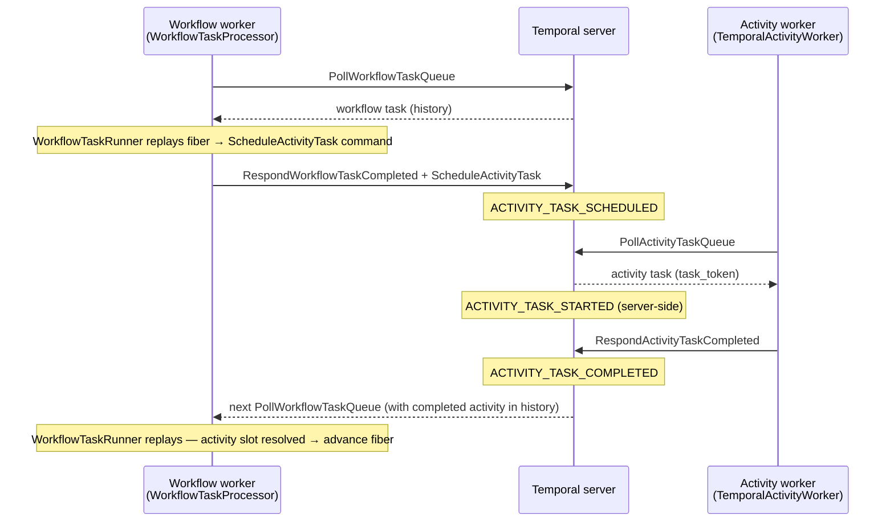

# DUR025 — Temporal WorkflowService gRPC RPCs: implementation map

## Status

Accepted

## Context

[DUR006](DUR006-no-official-temporal-php-sdk-and-no-roadrunner.md) requires using gRPC and protobuf stubs instead of the official Temporal PHP SDK. This ADR is the normative map from Temporal RPC names to their use context and implementing class in this repository.

The authoritative contract is the [Temporal API protobuf](https://github.com/temporalio/api/blob/master/temporal/api/workflowservice/v1/service.proto). Human-readable overview: [Workflow Service API](https://docs.temporal.io/references/workflow-service-api).

## Decision

### RPCs used

| RPC | Context of use | Implementing class |
|---|---|---|
| `StartWorkflowExecution` | Starting a workflow from application code (async or sync) | `WorkflowClient::startAsync()` / `startSync()` |
| `SignalWorkflowExecution` | Delivering an external signal to a running workflow | `WorkflowClient::signal()` |
| `QueryWorkflow` | Client-side read-only query to a running workflow | `WorkflowClient::query()` via `WorkflowServiceExecutionRpc` |
| `UpdateWorkflowExecution` | Client-side transactional update to a running workflow | `WorkflowClient::update()` via `WorkflowServiceExecutionRpc` |
| `PollWorkflowExecutionUpdate` | Long-poll for the result of an `UpdateWorkflowExecution` | `WorkflowClient::update()` via `WorkflowServiceExecutionRpc` |
| `GetWorkflowExecutionHistory` | Lazy, cursor-based pagination of history for fiber replay | `TemporalHistoryCursor` (follows `next_page_token`) |
| `PollWorkflowTaskQueue` | Long-poll for workflow tasks (workflow worker loop) | `TemporalWorkflowTaskPoller` |
| `RespondWorkflowTaskCompleted` | Delivering commands and query results back to Temporal | `WorkflowTaskProcessor` (commands from `WorkflowCommandBuffer`) |
| `PollActivityTaskQueue` | Long-poll for activity tasks (activity worker loop) | `TemporalActivityWorker` |
| `RespondActivityTaskCompleted` | Completing a successful activity execution | `TemporalActivityWorker` |
| `RespondActivityTaskFailed` | Reporting an activity execution failure | `TemporalActivityWorker` |
| `RespondActivityTaskCanceled` | Acknowledging a cancelled activity | `TemporalActivityWorker` |
| `RecordActivityTaskHeartbeat` | Cooperative heartbeat from a long-running activity | `TemporalActivityHeartbeatSender` (port: `ActivityHeartbeatSenderInterface`) |

### Commands emitted in RespondWorkflowTaskCompleted

Commands are built by `WorkflowCommandBufferInterface` and sent in `RespondWorkflowTaskCompletedRequest::commands`:

| `CommandType` | Trigger in workflow code | Attributes message |
|---|---|---|
| `COMMAND_TYPE_SCHEDULE_ACTIVITY_TASK` | `await activity(...)` — new slot (no history entry yet) | `ScheduleActivityTaskCommandAttributes` |
| `COMMAND_TYPE_START_TIMER` | `await delay(...)` — new slot | `StartTimerCommandAttributes` |
| `COMMAND_TYPE_COMPLETE_WORKFLOW_EXECUTION` | `#[WorkflowMethod]` returns normally | `CompleteWorkflowExecutionCommandAttributes` |
| `COMMAND_TYPE_FAIL_WORKFLOW_EXECUTION` | Unhandled exception in the workflow fiber | `FailWorkflowExecutionCommandAttributes` |
| `COMMAND_TYPE_REQUEST_CANCEL_ACTIVITY_TASK` | Cancellation requested for a pending activity | `RequestCancelActivityTaskCommandAttributes` |

### RPCs not used

| RPC | Reason |
|---|---|
| `SignalWithStartWorkflowExecution` | Start and signal are two separate operations in this implementation |
| `RespondWorkflowTaskFailed` | Not implemented — workflow errors are reported via `COMMAND_TYPE_FAIL_WORKFLOW_EXECUTION` |
| `ResetWorkflowExecution` | Not implemented |
| `TerminateWorkflowExecution` | Not implemented |
| `RequestCancelWorkflowExecution` | Not implemented |
| `DescribeWorkflowExecution` | Ad hoc tooling / tests only; not in the production path |
| `GetWorkflowExecutionHistoryReverse` | Reverse pagination is useless for replay (chronological order required) |
| `ListWorkflowExecutions` | External observability; out of scope for this component |
| `ScanWorkflowExecutions` | Same |
| `CountWorkflowExecutions` | Same |
| `RecordActivityTaskHeartbeatById` | Implementation uses `task_token` (not textual activity id) |
| `RespondActivityTaskCompletedById` | Same — `task_token` only |
| `RespondActivityTaskFailedById` | Same |
| `RespondActivityTaskCanceledById` | Same |
| `GetClusterInfo`, `GetSystemInfo`, `ListNamespaces`, … | Cluster administration; out of scope |
| Worker versioning RPCs (`UpdateWorkerVersioningRules`, …) | Out of scope |
| Scheduling RPCs (`CreateSchedule`, `ListSchedules`, …) | Out of scope |
| Batch operation RPCs (`StartBatchOperation`, …) | Out of scope |

### Activity lifecycle in Temporal history

The following are **history event types** written by the Temporal server, not gRPC method names. They appear as a result of the correct sequence of Durable bridge calls:

| History event | How Durable produces it |
|---|---|
| `ACTIVITY_TASK_SCHEDULED` | Workflow worker calls `RespondWorkflowTaskCompleted` with `COMMAND_TYPE_SCHEDULE_ACTIVITY_TASK` |
| `ACTIVITY_TASK_STARTED` | Activity worker calls `PollActivityTaskQueue` (server-side transition) |
| `ACTIVITY_TASK_COMPLETED` | Activity worker calls `RespondActivityTaskCompleted` |

## Consequences

- New bridge features must name the exact RPC and protobuf messages and update this ADR (DUR000)
- Tests with a real Temporal server cover `StartWorkflowExecution`, `WorkflowTaskProcessor`, and activity worker paths (DUR010)

## References

- Temporal documentation: [Workflow Service API](https://docs.temporal.io/references/workflow-service-api)
- Protobuf source: [`temporal/api/workflowservice/v1/service.proto`](https://github.com/temporalio/api/blob/master/temporal/api/workflowservice/v1/service.proto)
- Command reference: `temporal.api.command.v1` (`Command`, `CommandType`)

## Relationship to other ADRs

- **DUR006** — gRPC only; this ADR lists the RPC surface
- **DUR019** — gRPC bridge wiring
- **DUR024** — fiber-based interpreter; all commands produced by `WorkflowTaskRunner` flow through the RPCs listed here
- **DUR026** — commands-only orchestration; no journal signals
- **DUR027** — `WorkflowTaskRunner` algorithm
